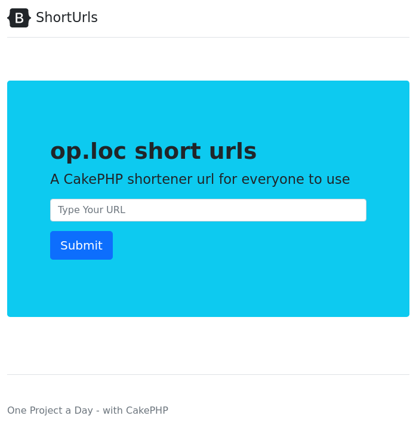
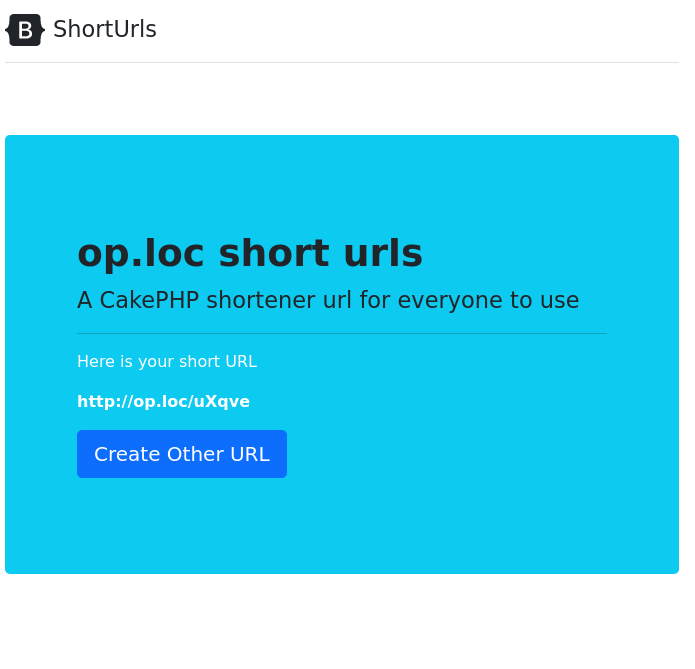

# One CakePHP project a day challenge - Day 08 Url Shortener

On this project I'm using CakePHP 4 (Custom Routes, Http Client, Custom id type) and Bootstrap 5

## Steps to create this project
- f6dc8c8 Initial
- 798a83a Added Model for Short Urls
  ```
  bin/cake bake migration CreateShortUrls id url
  bin/cake migrations migrate
  bin/cake bake model ShortUrls
  ```
- ba68788 Added pages to create a short url
- 02ea6cb Don't duplicate url in the database
- f201ca8 Add url validation
- 67b72a6 Check if url is valid
- 398fdcb Styled pages
- eeb8ded Added action to redirect to real urls


## Pages



